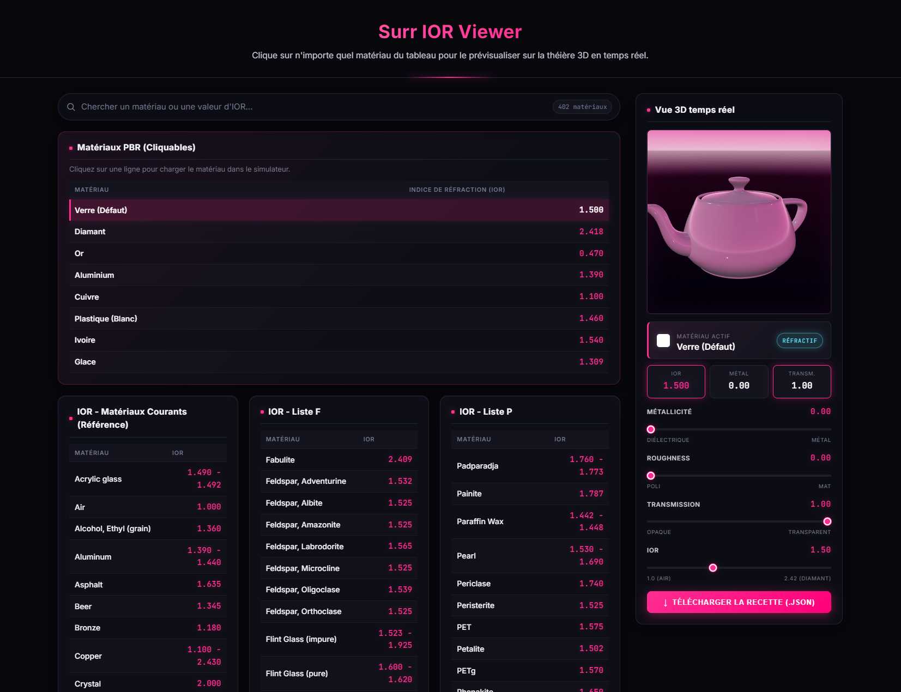

# Surr — IOR Viewer

> Mini-outil web pour visualiser en temps réel l'effet de l'**Indice de Réfraction (IOR)**, du **metalness**, du **roughness** et de la **transmission** d'un matériau PBR sur une théière 3D.

Fait partie de la collection **Surr Mini Tools** par [Surrendr](https://www.surrendr.art).

---

## Démo en ligne

[**→ Tester l'IOR Viewer**](https://surrendrart-hub.github.io/Surr-MiniTool-ior-Viewer/)


---

## Aperçu

Une interface sombre avec accents rose fluo, une théière 3D animée et environ **300 matériaux IOR cliquables** : verres, métaux, gemmes, plastiques, liquides…



---

## Fonctionnalités

- **Théière 3D temps réel** avec `MeshPhysicalMaterial` (Three.js)
- **Click‑to‑preview** : clique sur n'importe quelle ligne d'un tableau IOR pour charger ses paramètres
- **Paramètres live** : IOR, métallicité, roughness, transmission, épaisseur, clearcoat
- **Bandeau matériau actif** avec type (Diélectrique / Métal) auto‑détecté
- **Sliders** pour affiner chaque paramètre, l'IOR et la transmission se cachent automatiquement pour un métal
- **OrbitControls** légers : clic‑glisser pour tourner, molette pour zoomer (compatible tactile)
- **HDRI personnalisable** : dépose ton image équirectangulaire dans `images/hdri.jpg` et elle sera utilisée pour les reflets et la refraction. Fallback CDN puis environnement procédural si absente.
- **Classification automatique** des matériaux (Métal / Réfractif / Opaque) avec badge coloré et refraction physique active uniquement quand c'est pertinent
- **Export JSON** de la « recette matériau » prête à réutiliser dans Three.js, Blender, Unity…
- **Design sombre & responsive** (desktop / tablette / mobile)

---

## Utilisation rapide

1. Ouvre la [démo en ligne](https://surrendrart-hub.github.io/Surr-MiniTool-ior-Viewer/) (ou `index.html` en local).
2. Clique sur un matériau dans n'importe quel tableau — la théière 3D s'actualise instantanément.
3. Ajuste les sliders **Métallicité**, **Roughness**, **Transmission**, **IOR** pour personnaliser.
4. Clique sur **Télécharger la recette (.json)** pour exporter les paramètres.

Pour un tutoriel pas‑à‑pas, consulte [TUTORIAL.md](TUTORIAL.md).

---

## Lancer en local

Aucune installation requise — c'est du HTML / CSS / JS pur.

```bash
git clone https://github.com/surrendrart-hub/Surr-MiniTool-ior-Viewer.git
cd Surr-MiniTool-ior-Viewer
# Ouvre index.html dans ton navigateur,
# ou sers le dossier avec un petit serveur local :
python -m http.server 8000
# puis ouvre http://localhost:8000
```

> ⚠️ Le HDR et les scripts Three.js sont chargés depuis des CDN : une connexion internet est requise au premier lancement.

---

## Structure du projet

```
.
├── index.html          # Interface principale + tableaux IOR
├── css/
│   └── style.css       # Thème sombre + accents rose fluo, responsive
├── js/
│   └── app.js          # Scène Three.js, transitions, interactions
├── screenshots/        # Aperçus pour le README
├── README.md
├── TUTORIAL.md         # Tutoriel détaillé
├── publish.bat         # Script Windows de publication GitHub
└── .gitignore
```

---

## Comment ça marche

Le simulateur utilise le matériau physique de Three.js (`MeshPhysicalMaterial`) qui prend en compte :

| Paramètre        | Effet visuel                                                            |
|------------------|-------------------------------------------------------------------------|
| **IOR**          | Plus la valeur est haute, plus la lumière est déviée (effet « diamant ») |
| **Metalness**    | À 1.0 = métal pur, à 0.0 = diélectrique (verre, plastique…)              |
| **Roughness**    | À 0 = miroir / verre poli, à 1 = surface mate                            |
| **Transmission** | À 1 = transparent (laisse passer la lumière), à 0 = opaque               |
| **Thickness**    | Épaisseur virtuelle pour la réfraction (calculée auto)                   |
| **Clearcoat**    | Couche vernis pour les diélectriques (auto)                              |

Les paramètres réagissent en temps réel grâce à une interpolation linéaire (`lerp`) entre l'état courant et la cible, ce qui donne des transitions douces lorsqu'on saute d'un matériau à un autre.


---

## Technologies

- [Three.js r128](https://threejs.org/) — moteur 3D WebGL
- `MeshPhysicalMaterial` + `PMREMGenerator` + `TeapotGeometry`
- HTML5 / CSS3 / JavaScript vanilla (aucun framework, aucun bundler)
- Polices : [Inter](https://fonts.google.com/specimen/Inter) + [JetBrains Mono](https://fonts.google.com/specimen/JetBrains+Mono) (Google Fonts)

---

## Auteur

Fait avec soin par **[Surrendr](https://www.surrendr.art)**.

## Licence

Tous droits réservés © Surrendr — sauf mention contraire.
